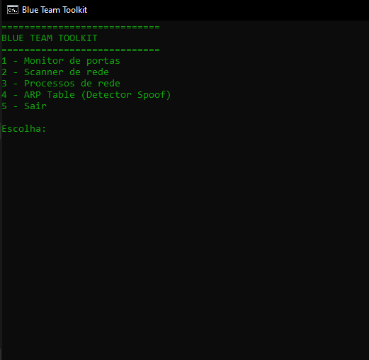

# BlueTeamToolkit
🛡️ Blue Team Toolkit (PowerShell)

## Estrutura do Projeto

```text
Desktop
 └ BlueTeamToolkit
      ├ monitor_portas.ps1
      ├ scanner_rede.ps1
      ├ detector_arp_spoof.ps1
      ├ processos_rede.ps1
      ├ executar_toolkit.bat
      └ logs
```

# O que esse toolkit permite fazer
```text
✔ monitorar portas abertas
✔ ver processos conectados
✔ descobrir dispositivos na rede
✔ analisar tabela ARP
✔ detectar atividades suspeitas

````


